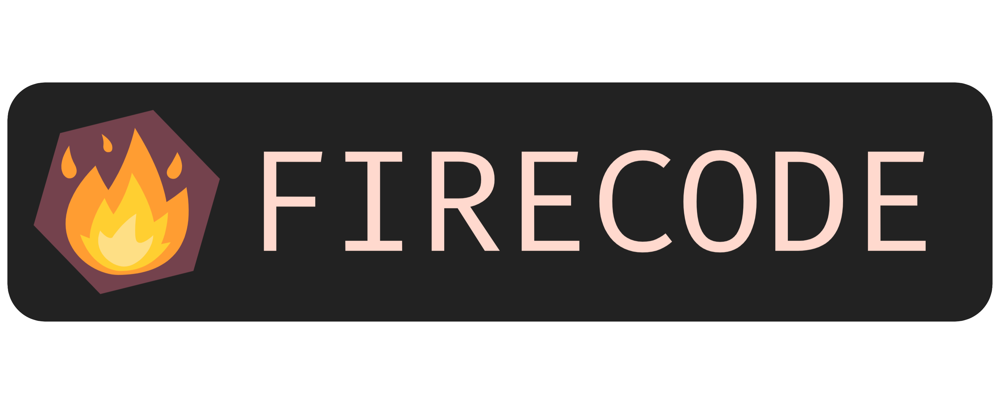

# FIRECODE - Filtering Refiner and Embedder for Conformationally Dense Ensembles

  

*FIRECODE is the expanded successor of [TSCoDe](https://github.com/ntampellini/TSCoDe).* 

FIRECODE is a computational chemistry toolbox for the generation, optimization and refinement of conformational ensembles. It features many flexible and highly customizable workflow utilities including conformer generation (via [CREST](https://github.com/crest-lab/crest) or FIRECODE), constrained ensemble optimization through popular calculators like [XTB](https://github.com/grimme-lab/xtb), [ORCA](https://www.orcasoftware.de/tutorials_orca/), [GAUSSIAN](https://gaussian.com/) and Pytorch Neural Network models via [ASE](https://github.com/rosswhitfield/ase) ([AIMNET2](https://github.com/isayevlab/AIMNet2)). It implements a series of conformational pruning routines based on inertia tensors, RMSD, symmetry-corrected RMSD, and more. It can also assemble non-covalent adducts from conformational ensembles (embedding) for fast and automated generation and evaluation of ground and transtition state-like structures. CPU and GPU multithreading is implemented throughout the codebase and linear algebra-intensive modules are compiled at runtime via [Numba](https://github.com/numba/numba).

## Documentation
Documentation on how to install and use the program can be found on [readthedocs](https://firecode.readthedocs.io/en/latest/index.html).